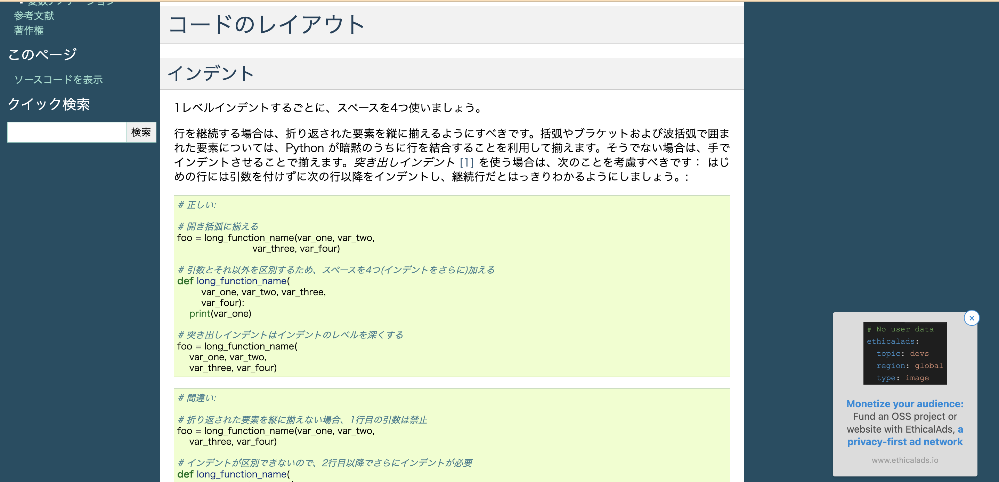
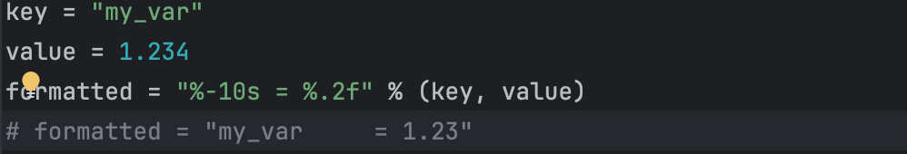
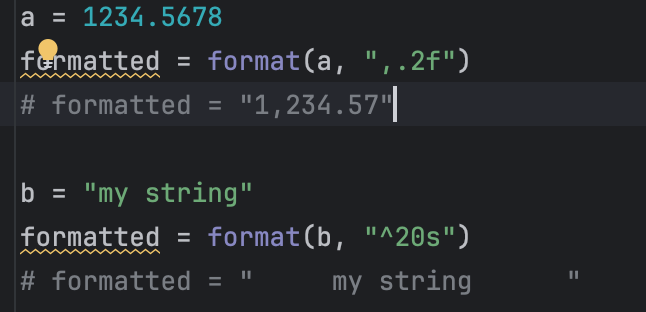
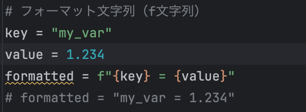

# Effective Python 輪読会 第1回

---

## Effective Python（第２版）とは
定価：3960円（税込）　著者：Brett Slatkin　翻訳：黒川利明　技術監修：石本敦夫

Pythonのベストプラクティスを90項目も紹介した本。
効率的で堅牢であるだけでなく、読みやすく、保守しやすく、改善しやすいPythonicなコードを書く秘訣を教えてくれる。

**※ Python3.8までに対応！**

---

## 目的
- Pythonのより良い（とされる）書き方を知る
- 議論を通じて理解を深める
- 部内のPythonの書き方を（できるだけ）統一する（したい）
- 勉強したい人のペースメイクをする

---

## 実施方法
- 週１回に１時間程度を目安に輪読会を開催する。
  - 基本的に金曜を想定中ですが、特に深い意味はない。
  - できれば１回１章。必要に応じて内容の取捨選択あり。
  - 自分の発表担当の回以外は自由参加。
- 各回に発表者を事前に割り当て、発表者は担当箇所をまとめてくる
（スライド、サンプルコードなど）
  - 資料は全く凝る必要はない。無理なく継続したい。

---

# 1章　Pythonic思考

---

## Pythonicとは？

**造語です。**
Pythonの特定のスタイルに沿ったコードを表すのに使われる形容詞。

**Pythonic = 単純かつ明快、管理しやすいコードをPythonイディオムで書くさま**

この章では、普通のことをPythonicに行う方法が紹介されている。

---

## 項目１　使用するPythonのバージョンを知っておく

自明。`python --version` or `python3 --version`で確認可能。

※ `python`はPython2.7のエイリアスであることが一般的。
※ Python3を使いたい時は`python3`コマンドを使うこと。

---

## 項目２ PEP8スタイルガイドに従う
PEP8 := Python拡張提案(Enhancement Proposal) #8
- https://pep8-ja.readthedocs.io/ja/latest/https://pep8-ja.readthedocs.io/ja/latest/
- Pythonのコードのフォーマットのスタイルガイド

---

### なぜPEP8に従うか？
1. 一貫したスタイルにすることで、コードが扱いやすく、読みやすくなる
2. **みんなが使っている**ものを使った方が、お互いのコードも読みやすい

---

### PEP8の例
- インデントにはタブではなく空白を用いる
- 各行は長さが79文字がそれ以下とする
- 関数、変数、属性はlowercase_underscore
- プロテクテッド（保護）属性は、アンダースコアは先頭につける

---

## 項目３ bytesとstrの違いを知っておく

Pythonでの文字列データを表す方法・・・ **`str`** or **`bytes`**

- **`str`** = Unicodeエンドコードの配列

- **`bytes`** = 生の符号なし8ビット値の配列

---

そもそも...

## **文字コード** ≒ **符号化文字集合** + **文字符号化方式**

### 符号化文字集合
取り扱う文字の全体集合を定め、コードポイント（非負整数）を割り振った対応付け。

### 文字符号化方式
符号化文字集合で文字に対応づけた非負整数値を、実際にコンピュータが利用するバイト列に変換する（符号化）方式。

---

---

おなじ文字列"あい"を表すstrとbytesとしても...

bytesとstr間の変換には、文字符号化方式を明示する必要がある

---

### Pythonにおける文字列データのおすすめ運用... Unicodeサンドイッチ

インターフェースの一番遠いところでUnicodeの符号化・復号化をし、
プログラムの核心部分ではUnicodeデータのstr型を使い、
文字の符号化について一切の仮定を置かない

---

---

### strとbytesを使う時の注意点

コードで紹介

---

## 項目4 Cスタイルフォーマット文字列とstr.formatは使わず
## f文字列で埋め込む

Pythonでは、前もって用意したテンプレートにデータを埋め込んで文字列を作れる。
1. Cスタイルフォーマット文字列
2. 組み込みのformatとstr.format
3. フォーマット文字列（f文字列）

可読性、変更への強さという観点から、**f文字列**がおすすめ

---

### Cスタイルフォーマット文字列

問題点４つ
1. データ値の型や順序の変更によって型変換エラーが生じる（変更に弱い）
2. フォーマット前にデータを加工すると見にくい（可読性低い）
3. 同じ値を複数使う時に右側に繰り返し書く必要がある（修正漏れしやすい）
4. フォーマット式で辞書を使うと、冗長でうるさい（可読性低い）

---

コードを参照

---

### str.format

問題点（Cスタイルフォーマットの２つ目と４つ目と同じ）
1. フォーマット前にデータを加工すると見にくい（可読性低い）
2. フォーマット式で辞書を使うと、冗長でうるさい（可読性低い）

---

コードを参照

---

### フォーマット文字列（f文字列）

そのテンプレートのスコープ内の全ての変数を参照して、フォーマットする
前２つの方式の問題を解決することができている（らしい）

---

コードを参照

---

f文字列を使いましょう！

---

## 項目5 複雑な式の代わりにヘルパー関数を書く

複雑な式（特に同じロジックを繰り返す必要があう場合）はヘルパー関数として切り出す。
- Pythonの構文を使えば複雑なロジックを１行で書けてしまうが、理解しにくい
- DRY原則 (Don't Repeat Yourself)　繰り返し同じものを書かない方が良い

---

コードを参照

---

## 項目6 インデックスではなく複数代入アンパックを使う

タプルやリスト（全てのイテラブル）の要素を展開して複数の変数に代入すること

アンパックのメリット = **可読性**
- インデックスでのアクセスよりもスッキリ見える
- ２つの要素のスワップが一時変数なしでできる
- for文、内包表記等をわかりやすく書ける

---

コードを参照

---

## 項目7 rangeではなくenumerateを使う

リストの要素の処理中にインデックスも必要なことがある。

`range`を使ってfor文を回してインデックスアクセスするより、
`enumerate`を使った方が簡潔になりやすい

※ `enumerate`は遅延評価ジェネレータを返すため、メモリの消費量は心配ない！

---

コードを参照

---

## 項目8 イテレータを並列に処理するにはzipを使う

２つの関係するリストを同時に走査したい場合がある。
`range`からインデックスを経由して両方の要素にアクセスするより、
`zip`を用いて直接両方の要素にアクセスした方が簡潔になりやすい。

---

### zipを使う際に頭に入れておくべきこと

- `zip`は遅延評価ジェネレータを返すため、メモリの消費量は心配ない！
- ２つのリストの長さが異なる場合、短い方の長さ分のジェネレータしか返さない...
- `itertools.zip_longest`を使えば、最長のリストに合わせたジェネレータを返す

---

## 項目9 forループとwhileループの後のelseブロックは使わない
Pythonのループでは、繰り返しブロックの直後に`else`をおくことができるが...
`if/else`、`try/exept/else`と`for/else`、`while/else`は挙動が反対（に思える）
※ 実際には`for`や`while`ブロック中で`break`されなければ`else`が実行される

---

### さらなる注意点

場合によっては、`if/else`と同じような挙動にもなる。

`for/else`や`while/else`を使うのはやめた方が良いでしょう。

---

## 項目10 代入式で繰り返しを防ぐ
代入式 = 変数に値を代入しながら、評価するとその値を返す式

